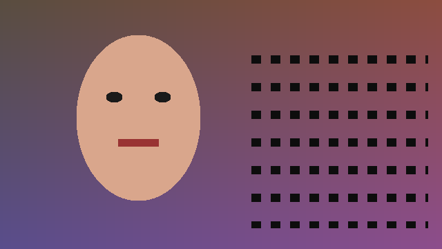
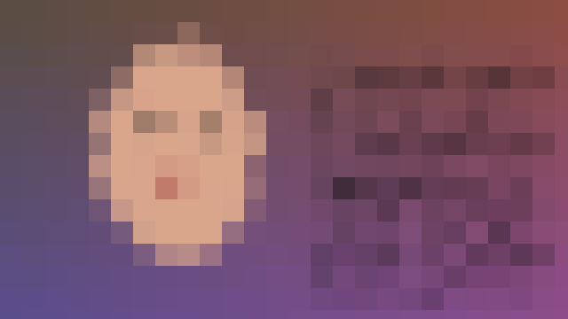
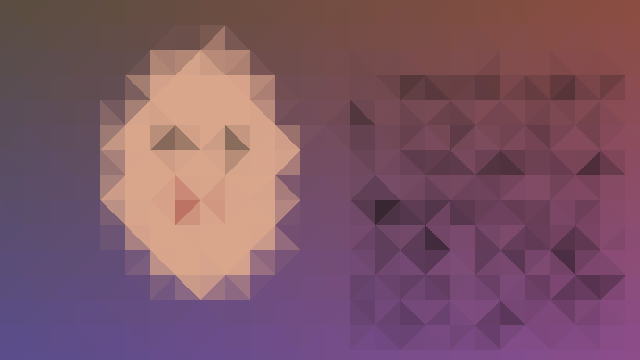
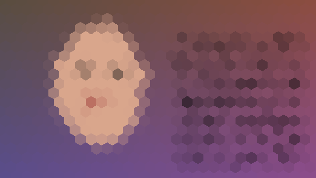

# Multi-Layer Anonymizer

A native, Metal-accelerated anonymization effect for **Adobe Premiere Pro**,
**DaVinci Resolve**, **Final Cut Pro / Motion**, and **Adobe Photoshop**
(macOS) that obscures
image regions by stacking three independent obfuscation layers in a single
effect:

1. **Random spatial distortion** — value-noise displacement warps the image by
   a pseudo-random field, destroying the pixel-to-pixel correspondence that
   deblurring and mosaic-reversal tools rely on.
2. **Gaussian blur** — removes the high-frequency detail.
3. **Mosaic** — pixelates the result, with a square, triangle, or hexagon
   tiling (a purely cosmetic choice — all three sample the same way).

| Before | After (default settings) |
|---|---|
|  |  |

| Triangle mosaic | Hexagon mosaic |
|---|---|
|  |  |

**Why multiple layers?** A plain blur is a (roughly) invertible convolution, and
plain mosaic averages are increasingly recoverable with ML reconstruction. Here,
each mosaic block averages content that was *already* blurred and *already*
displaced by an unpublished random amount, so there is no clean inverse — an
attacker would have to jointly undo three lossy, keyed transforms.

## Effect parameters

| Parameter | Default | Notes |
|---|---|---|
| Distortion Amount | 15 | Maximum displacement of the warp field |
| Distortion Scale | 10 | Size of the noise features |
| Blur Radius | 15 | Gaussian radius (sigma = radius/2) |
| Mosaic Block Size | 25 | Pixelation block size |
| Mosaic Shape | Square | Square, Triangle, or Hexagon tiling |
| Random Seed | 0 | Change for a different distortion pattern |
| Temporal Jitter | On | New distortion pattern every frame |
| Blackout | Off | Solid black instead of the distort/blur/mosaic stack (source alpha preserved) |

Pixel-space parameters are specified **at a 1080p reference** and scale with
the rendered frame height, so the anonymization strength is identical at
1080p, 4K, or 8K — and proxy/preview renders match the full-resolution
output automatically.

Blackout is the zero-information option: nothing of the covered pixels
survives, so use it (with an effect mask) when the region must be provably
unrecoverable and aesthetics don't matter.

Temporal Jitter trade-off: **on** prevents an attacker from treating the warp as
a fixed transform across frames (and looks "alive"); **off** gives a static
warp, which avoids any multi-frame averaging of a static background revealing
detail. For moving subjects, keep it on.

## Requirements

- macOS on Apple Silicon (arm64-only by default; configure with
  `-DCMAKE_OSX_ARCHITECTURES="arm64;x86_64"` for a universal build)
- Xcode Command Line Tools, CMake 3.21+
- Adobe **After Effects SDK** and **Premiere Pro SDK** (see below)
- Apple **FxPlug 4 SDK** (optional — only needed for the Final Cut Pro
  plugin; the build skips it when the SDK is absent)
- Adobe **Photoshop plugin SDK** (optional — only needed for the Photoshop
  plugin; the build skips it when the SDK is absent)
- Premiere Pro with the renderer set to *Mercury Playback Engine GPU
  Acceleration (Metal)* for the GPU path; *Software Only* uses the CPU path
  (identical output, verified to ~1e-7)

## SDKs

The `sdk/` folder contains vendored Adobe SDK headers for local development
convenience. They are Adobe-licensed and **must not be redistributed** — the
folder is git-ignored on purpose. For a clean setup, download the official
SDKs from the [Adobe Developer Console](https://developer.adobe.com/console/servicesandapis)
(Premiere Pro SDK, After Effects SDK, and optionally the Photoshop plugin
SDK; free with an Adobe ID) and point CMake at them:

```sh
cmake -B build \
  -DAE_SDK_PATH=/path/to/AfterEffectsSDK \
  -DPR_SDK_PATH=/path/to/PremiereProSDK
```

Both paths refer to the SDK root that contains `Examples/`. The Premiere SDK's
`Examples/Projects/GPUVideoFilter/Utils` (for `PrGPUFilterModule.h`) is picked
up automatically. The Photoshop SDK is looked for at `sdk/photoshop/pluginsdk`
(override with `-DPS_SDK_PATH=/path/to/pluginsdk`, the folder containing
`photoshopapi/`).

## Build & install

```sh
cmake -B build -DCMAKE_BUILD_TYPE=Release
cmake --build build
./scripts/install.sh   # copies to /Library/.../Adobe/Common/Plug-ins/7.0/MediaCore (sudo)
```

Restart Premiere Pro. The effect appears in the Effects panel under
**Video Effects → Aagedal → Multi-Layer Anonymizer**. To limit it to a face or
plate, use Premiere's built-in effect masks in the Effect Controls panel
(ellipse/pen mask + tracking), like with any other effect.

### DaVinci Resolve (OpenFX)

The same build also produces `build/Anonymizer.ofx.bundle`, an OpenFX plugin
with identical parameters and output, GPU-accelerated via the same Metal
kernels. Install with:

```sh
./scripts/install_ofx.sh   # copies to /Library/OFX/Plugins (sudo)
```

Restart Resolve; the effect appears in **OpenFX → Filters → Aagedal**
(Color page and Edit page). Combine it with a power window + tracker on the
Color page to follow a face. The OFX SDK and Blackmagic's Support library are
vendored under `ofx/openfx/` (BSD licensed, redistributable). The OFX plugin
should also load in other OFX hosts (Nuke, Vegas, Flame), though only Resolve
has been targeted; non-Metal hosts use the CPU path.

### Final Cut Pro / Motion (FxPlug 4)

With the [FxPlug 4 SDK](https://developer.apple.com/download/all/?q=FxPlug)
installed, the build also produces `build/Multi-Layer Anonymizer.app` — an
FxPlug wrapper app carrying the effect as an XPC service, plus the Motion
template FCP needs (bundled in the app's Resources). Install with:

```sh
./scripts/install_fxplug.sh   # copies to /Applications, registers, installs the template
```

Launching the app once registers the plugin with PluginKit and copies the
Motion template into `~/Movies/Motion Templates.localized/`. Restart Final
Cut Pro; the effect appears in the Effects browser under
**Aagedal → Multi-Layer Anonymizer**. Use FCP's Draw Mask/Shape Mask on the
effect to confine it. Notes:

- **Final Cut Pro never lists raw FxPlug filters** — they only appear
  through a published Motion template (this is how all FxPlug products
  ship). End users do not need Motion; the pre-published template in
  `fcp/templates/` is installed for them. Re-publish the template in Motion
  only if the parameter set changes.
- The build signs with your best available identity (Developer ID, then
  Apple Development, then ad-hoc; override with `SIGN_IDENTITY=`). The XPC
  service **must** be signed with the sandbox entitlement — PluginKit
  silently ignores unsandboxed plugins.
- FxPlug renders out-of-process: FCP hands the plugin IOSurface-backed Metal
  textures; a copy-in kernel and an output render pass bridge those to the
  same shared buffer kernels used by the other two hosts.

### Photoshop

With the Photoshop plugin SDK in place, the build also produces
`build/AnonymizerPS.plugin` — a classic filter plugin sharing the exact same
pass pipeline (CPU path). Install with:

```sh
./scripts/install_ps.sh   # copies to /Library/.../Adobe/Plug-Ins/CC (sudo)
```

Restart Photoshop; the filter appears under **Filter → Aagedal →
Multi-Layer Anonymizer…** and works on RGB and Grayscale documents at 8, 16,
and 32 bits per channel, respecting selections. Parameter values carry the
same 1080p-reference semantics as the video hosts, scaled by the document's
shorter dimension. The filter is not yet recordable with parameters in
Actions (it reruns with its last-used values instead).

A ready-made action (`ps/actions/`) is bundled: it duplicates the current
layer as a smart object, applies the anonymizer as a smart filter, adds an
inverted (hidden) mask, and selects a white brush — so you just paint where
the anonymization should appear. The installer imports it into the Actions
panel automatically (by opening the `.atn` once); it is also copied into
each Photoshop's `Presets/Actions` for the Classic Actions panel's flyout
menu, and kept next to the plugin so it can be re-imported any time by
double-clicking. Branded editions get a rebranded copy generated at build
time by `scripts/make_ps_action.py`.

### Installer package

To distribute instead of installing directly, build an installer package
containing all plugins (each selectable at install time):

```sh
./scripts/make_pkg.sh  # -> build/MultiLayerAnonymizer-<version>.pkg
```

The pkg installs the plugins system-wide. For recipients outside your own
machine, sign it (`SIGN_IDENTITY="Developer ID Installer: ..."
./scripts/make_pkg.sh`) and notarize (`xcrun notarytool submit ... --wait`,
then `xcrun stapler staple`); unsigned packages downloaded from the internet
are blocked by Gatekeeper until right-click → Open.

### Branded editions

The effect name, category, bundle identifiers, and installer branding are
set at configure time from `editions/<name>.cmake` (default: `oss`, the
Multi-Layer Anonymizer). To build a custom-branded edition, copy
`editions/oss.cmake` to `editions/yourname.cmake`, change the values
(generate fresh UUIDs for the FxPlug entries), and configure with
`-DANON_EDITION=yourname` into its own build directory:

```sh
cmake -B build-yourname -DCMAKE_BUILD_TYPE=Release -DANON_EDITION=yourname
cmake --build build-yourname
./scripts/make_pkg.sh build-yourname
```

Differently-branded builds share every line of algorithm code, render
identically, and can be installed side by side. All `scripts/*.sh` accept
the build directory as their first argument (default `build`).

## How it works

The algorithm lives in `shared/` and is compiled into all three host plugins:

- `shared/AnonymizerAlgo.h` — the CPU passes, noise/hash functions, and the
  parameter ranges/defaults, host-independent.
- `shared/AnonymizerKernel.h` — the MSL kernels, embedded as a string and
  compiled at runtime on the GPU device the host hands us. Handles 16-bit
  half and 32-bit float frames. The noise functions mirror the C++ exactly so
  CPU and GPU renders are interchangeable (verified to ~1e-7).

**Premiere Pro** (`src/`): a standard AE-style effect (`EffectMain`) paired
with a Premiere GPU filter (`xGPUFilterEntry`) in the same binary — the
pattern used by Adobe's `SDK_ProcAmp` sample; Premiere binds the GPU filter to
the effect through the PiPL. Per frame the GPU path encodes four compute
dispatches with no CPU readbacks: `distort → blur H → blur V → mosaic`,
ping-ponging through two temp buffers allocated per render and released by
the command buffer's completion handler (renders overlap and vary in size,
so instance-cached buffers would race).

**DaVinci Resolve** (`ofx/`): an OpenFX image effect built on Blackmagic's
OFX Support library, following their `GainPlugin` sample. Resolve passes
Metal command queues and buffer-backed images; the same four kernels run with
temp buffers allocated per render.

**Final Cut Pro** (`fcp/`): an FxPlug 4 plugin — an XPC service inside a
wrapper app, following Apple's Xcode template. The host provides
IOSurface-backed textures, bridged to the shared buffer kernels by a small
copy-in compute kernel and a fullscreen-quad output pass.

`Random Seed`, frame number, and `Temporal Jitter` feed the identical 32-bit
seed derivation on every path, so all hosts, GPU and CPU, produce the same
anonymization for the same settings.

## Anonymization notes (honest caveats)

- Set parameters generously. If the mosaic blocks are large relative to the
  face (as in the screenshot), identity recovery from the image itself is not
  realistic. Tiny values (e.g. blur 3 px, mosaic 4 px, distortion 2 px) are
  cosmetic, not protective.
- The effect protects the *pixels you cover*. Reflections, shadows, voice,
  clothing, tattoos, and context still identify people.
- Export the anonymized render and share only that. Project files reference
  the original media.
- The warp is keyed by the seed but the algorithm is public; protection comes
  from the information destroyed by blur + mosaic after displacement, not from
  seed secrecy.

## License

MIT — see [LICENSE](LICENSE). The vendored OpenFX SDK and Support library
under `ofx/openfx/` are BSD-licensed by The Open Effects Association and
Blackmagic Design (see `ofx/openfx/LICENSE`). The Adobe and Apple SDKs
required to build are **not** included and are covered by their own license
terms (see the SDKs section above).

## Extending to Windows

The CPU path is already portable. For GPU on Windows, add CUDA/DirectX
variants of the kernels (see Adobe's `SDK_ProcAmp` sample for the CUDA
scaffolding) and a `.rc`/`PiPLtool` step for the PiPL; `Anonymizer_GPU.mm`
would split into a shared host file plus per-API dispatch.
